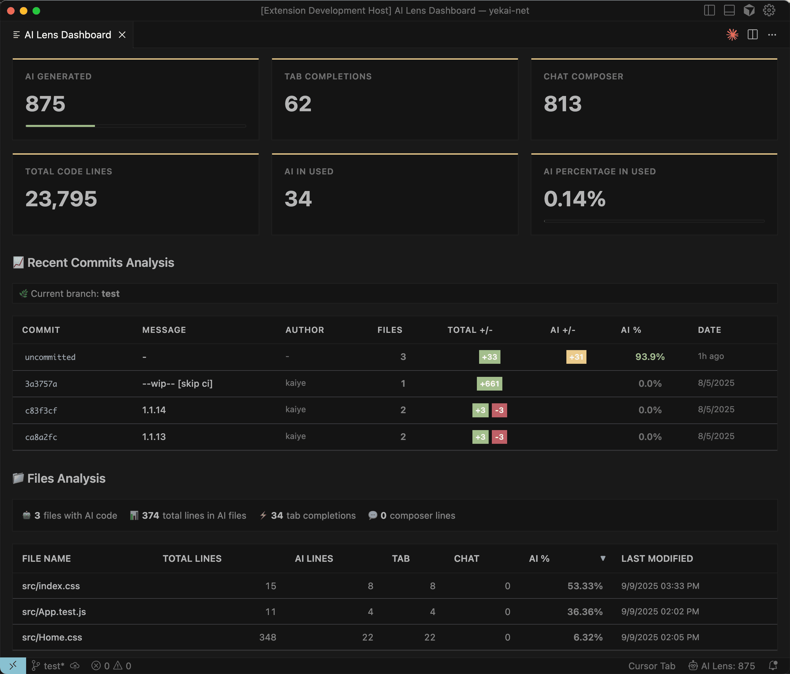

# AI Lens — VS Code Extension

AI Lens helps you understand how much of your workspace was generated by AI. It reads Cursor’s SQLite database and your editor changes, matches AI items to code lines using hashing, and shows results in a dashboard.

## Features
- Real‑time monitoring of AI events (Cursor)
- Line‑level matching via hashing inference
- Workspace stats: total lines, AI lines, source breakdown
- Dashboard with per‑file details and export

## Screenshot

## Commands (Command Palette)
- AI Lens: Open AI Dashboard
- AI Lens: Start AI Code Monitoring
- AI Lens: Stop AI Code Monitoring
- AI Lens: Show AI Code Statistics

## Settings
- `ailens.autoStart` (default `true`)
- `ailens.updateInterval` (default `1000` ms)
- `ailens.showNotifications` (default `true`)

For architecture and technical details, see [TECH_DESIGN.md](./TECH_DESIGN.md).
