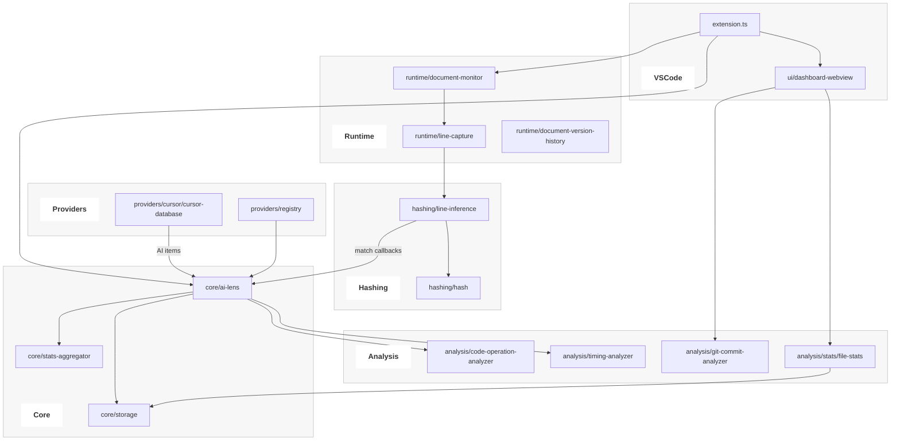

# AI Lens — 技术设计说明

本文档面向开发者，阐述扩展的目标、架构分层、核心数据流与关键模块职责，供后续演进与协作参考。

> 使用说明和功能介绍见 [README.md](./README.md)。

## 目标与范围
- 面向 VS Code，统计工作区中由 AI 生成的代码行数与比例，并可视化展示。
- 以 Cursor 的 SQLite 数据为主要来源；同时为“多来源 AI 探测”预留抽象，后续可扩展。
- 运行时对编辑器文档做行级采集，配合 Hash 推断，提升匹配精度与可解释性。

## 分层架构与目录
- Core（核心编排）
  - `core/ai-lens.ts`：生命周期管理、总控编排、状态汇聚
  - `core/storage.ts`：AI 代码行的持久化与统计快照（`~/.ailens/`）
  - `core/stats-aggregator.ts`：总行数/占比/来源拆分的聚合计算
  - `core/types.ts`：统一类型
- Providers（来源）
  - `providers/cursor/cursor-database.ts`：监听 Cursor 数据库（智能去重 + 变更检测）
  - `providers/registry.ts`、`providers/types.ts`：提供者注册与接口
- Runtime（运行时采集）
  - `runtime/document-monitor.ts`：监听 VS Code 文档变化
  - `runtime/line-capture.ts`：插入/删除/替换 → 行记录构建
  - `runtime/document-version-history.ts`：轻量历史，辅助删除内容推断
- Hashing（哈希与推断）
  - `hashing/hash.ts`：MurmurHash3，与 Cursor 兼容
  - `hashing/line-inference.ts`：行级 Hash 推断（AI item ↔ 行记录）
- Analysis（分析与解释）
  - `analysis/code-operation-analyzer.ts`：基于时序的操作级分析
  - `analysis/timing-analyzer.ts`：事件相关性分析
  - `analysis/git-commit-analyzer.ts`：Git 提交维度的 AI 贡献推断
  - `analysis/stats/file-stats.ts`：面向 UI 的文件级统计与存在性验证
- UI（可视化）
  - `ui/dashboard-webview.ts`：仪表盘容器（数据装配、消息处理）
  - `ui/helpers/git.ts`：Git 信息获取与 URL 格式化
- Utils（工具）
  - `utils/workspace-utils.ts`：工作区扫描与路径工具
  - `utils/debounce.ts`：事件去重

## 数据流（端到端）
1) 运行时采集：DocumentMonitor 捕获编辑器变更 → LineCapture 生成行记录 → 送入 LineInference 缓存。
2) 提供方输入：CursorDatabase 监听 SQLite → 推送 AI items 给 Core。
3) 内容匹配：LineInference 用文件名/操作/内容计算 Hash 并与 AI items 匹配 → 命中回调 `core/ai-lens.updateAIStatsOnHashMatch` → Storage 入库。
4) 统计聚合：StatsAggregator 汇总存储、计算总行数/占比/来源拆分；Timing/Operation Analyzer 提供解释层数据。
5) 可视化：Dashboard WebView 通过 FileStatsService 拉取明细，GitCommitAnalyzer 提供提交维度补充；支持导出。

## 模块交互示意图

## 关键设计选择
- 单一 Hash 真理源：所有哈希计算集中在 `hashing/hash.ts`，避免重复实现。
- 推断与存储解耦：行级推断在 Hashing 层，命中后通过 Core 统一入库，Storage 不做反推。
- 分层薄化：UI 仅数据装配；统计由 StatsAggregator 与 FileStatsService 提供；运行时行捕获由纯函数产出。
- 可插拔来源：Provider 接口与 Registry 允许并行接入更多 AI 工具，无需修改 Core 主流程。

## 构建与发布（概要）
- 构建：`npm run compile`（TS → `out/`，拷贝 `src/webview`）
- 打包：`npx vsce package`（VS Code）或 `npx ovsx publish -p <token>`（Open VSX）
- 降体积：通过 `.vscodeignore` 排除源码与测试，后续可评估 bundler

> 说明：使用与安装面向用户的说明见英文 `README.md`。
